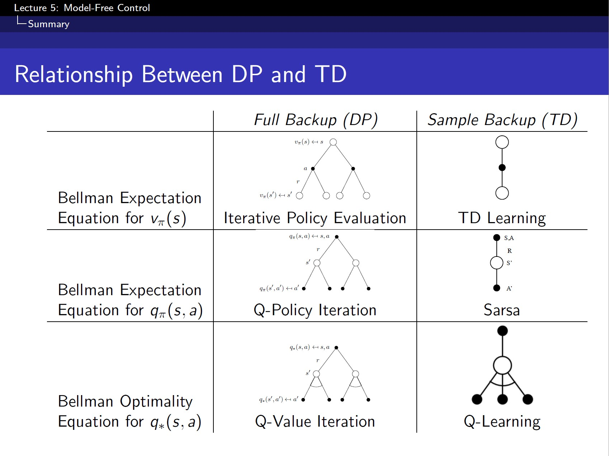

# Model-Free Control

- On-Policy: 학습(최적화)하고자 하는 policy와 실제 환경에서 경험을 쌓는(behavior) policy가 같을 때
- Off-Policy: ~ 다를 때.(다른 agent policy의 경험으로부터 배우는 방법)
- Policy Iteration = Control 방법론 = policy(최적의 value function)를 찾는 방법론 = Policy evaluation 및 Policy improvement를 반복 수행

## On-Policy Monte-Carlo Control

### Epsilon-Greedy Exploration

- 모든 action에 대한 exploration을 보장할 수 있음
- policy가 계속 발전함을 보장할 수 있음

- Monte-Carlo Policy Iteration -> Monte-Carlo **Conrol**  
    Every episode:
    - Policy evaluation: Motel-Carlo policy evaluation, $Q = q_\pi$ (Policy Iteration) -> **$Q \approx q_\pi$ (Control)**
    - Policy improvemnt: **$\epsilon$**-greedy policy improvement

$ $

### GLIE Monte-Carlo Control

-  GLIE(Greedy in the Limit /w Infinite Exploration) property: 
    1. 모든 state-action pair로 탐험 가능 (k가 무한대로 갈 때)
    2. 최종적으로 $\epsilon$이 줄어들어서 greedy policy로 수렴
- $\epsilon$ <- 1/k 로 두고 epsilon-greedy 진행
- 그럼 optimal action-value function에 수렴함

$ $

## On-Policy Temporal-Difference Learning
### MC vs. TD Control -> 그럼 MC 말고 TD로 바꿔서 하면 더 좋지 않을까? 가능! 이게 바로
### **Sarsa($\lambda$)**

- On-Policy Control with **Sarsa** --> 기존 Control 보다 수렴정도가 더 짧아짐  
    Every **time-step**:
    - Policy evaluation: **Sarsa**, $Q \approx q_\pi$
    - Policy improvemnt: **$\epsilon$**-greedy policy improvement  
- Sarsa의 수렴 조건
    - GLIE 해야함 (앞에 두 성질 참고)
    - Robbins-Monro: step-size $\alpha$에 관련 조건

- n-Step Sarsa
- Backward View Sarsa($\lambda$)
    - 기존의 TD($\lambda$)에서 달라진 점은 알고리즘에서 마지막에 For loop이 들어가서 한 action 하게 될 때 TD($\lambda$)는 그 칸만 업데이트 했었는데, Sarsa($\lambda$)에서는 모든 state에 대해서 업데이트 -> 과거에 지나갔던 states도 Eligibility Traces를 반영 

$ $

## Off-Policy Learning

- $\mu$ (경험하는 Behavior policy)와 $\pi$ (학습하는 Target policy)가 존재
    - $\mu$: 실제 action을 sampling하는 policy
- $\mu$와 $\pi$가 다른 게 Off-policy learning임 
- 이전에 했던 경험들을 reuse할 수 있어서 효율적이라는 장점

- 탐험적인 행동을 하면서, 동시에 optimal policy를 배울 수 있음
- 하나의 policy를 따르면서, 동시에 multiple policies를 학습 가능

### Importance Sampling

- 기존의 (확률)분포가 아닌 다른 분포를 가지는 (action pr value의) 기대값을 구하고자 할 때 **기존의 분포에 대한 다른 분포의 비율**을 곱함   
(기대값을 분해해서 보면 다른 분포를 밖으로 꺼내서 볼 수 있기 때문)
- 이를 target policy 와 behavior policy 의 비율로 적용된다고 보면 됨

#### Importance Sampling for Off-Policy **Monte-Carlo**

- state-action 개수에 따라서 각 target/behavior policy들이 전부 다르므로 각 step의 target/behavior policy 비율을 전부 곱해줌
- But, MC의 방법으로는 현실적으로 불가능. variance 너무 커서 발산할 수 있으며, $\mu=0$ 일 때 불가능
- 그래서 다음 내용인 Q-learning을 사용하게 됨
- 만약 MC대신 TD를 사용하면, 1step마다 업데이트 하므로, importance sampling ratio가 하나만 있으므로 variance가 MC보다 훨씬 작아져서 사용 가능.

### Q-Learning

- action value인 q를 Off-policy로 학습을 하고 싶은데 importance sampling이 없이 가능 할까? --> 결론적으로 가능하다.
- $A_{t+1}$과 $A_{t}$ 모두 behavior policy $\mu$에서 고른 후에 $S_{t}$에서 action을 했고 우리는 그에 대한 action value Q를 구하고 싶은거야
- 그리고 TD target 자리에 그 다음 state에서의 'reward (policy와 상관 X) + $\gamma*$추측치'가 들어가고, 추측치에는 다음 state $S_{t+1}$에서 할 action의 action value Q가 들어가게 됨
- 여기서 **할 action $A$는 $\mu$로부터의 $A_{t+1}$이 아닌 학습하고자 하는 $\pi$를 따랐을 때의 $A'$을 사용** --> 이게 **Q-learning**

#### Off-Policy Control with Q-Learning

- 일반적으로 **target policy $\pi$** 는 greed, **behavior policy $\mu$는 $\epsilon$-greedy**를 사용함  
  (target은 무조건 잘하도록 greedy하게 하면서 행동은 다양하게)

