# **Artificial Neural Network**

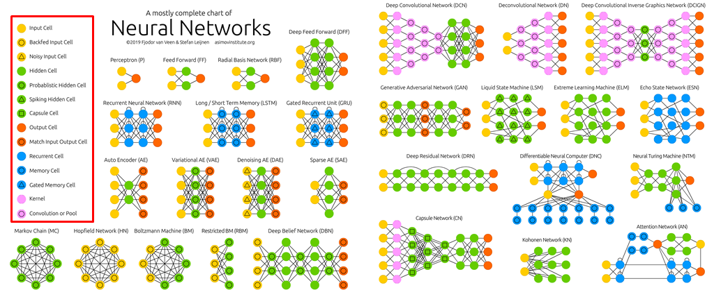

- 위에 여러 신경망들이 있지만, 이 중에서 대표적인 10가지만 알아보자

- 위 그림에서는 왼쪽 부분의 각 cell의 색과 안에 세모 네모와 같은 기호가 의미하는 바만 보고 넘어가도록 하자

  

1. **Deep Feedforward Network (DFN)**

2. **Recurrent Neural Network (RNN)**

3. **Long Short-Term Memory (LSTM)**

4. **Auto Encoder (AE)**

5. **Variational Auto Encoder (VAE)**

6. **Convolutional Neural Network (CNN)**

7. **Deep Residual Network (DRN)**

8. **Generative Adversarial Network (GAN)**

9. **Graph Neural Network (GNN)**

10. **Spiking Neural Network (SNN)**

- 위에 나열한 대표적인 인공 신경망에 대해서 그 구조와 개념을 **간단히** 알아보자 (모든 개념을 5줄 이내로 설명해 보자) 

## 1. Deep Feedforward Network (DFN)

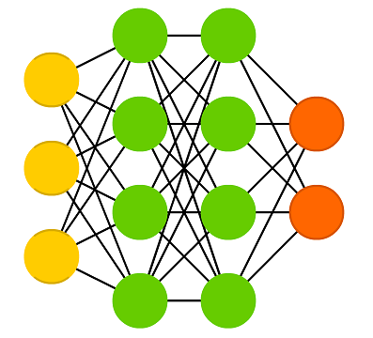

- 딥 러닝의 가장 기본적인 인공신경망
- 입력층, 은닉층, 출력층으로 구성
- 보통 2개 이상의 은닉층을 이용
- 예측값으로 변환된 뒤, 현재 데이터에 대한 정보는 완전히 사라짐 (저장X) → 시계열 데이터 처리 시 한계점 존재
- 이를 보완하기 위해 제안된 것이 RNN

## 2. Recurrent Neural Network (RNN)

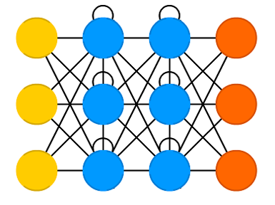

- 시계열 데이터(or 문자열) 같이 시간적 연속성 있는 데이터 처리를 위해 등장

- (앞에 입력된) 이전 시간 데이터에 의해 뒤에 입력된 데이터의 예측이 영향 받음

- (Feedforward 방식의) DFN으로는 시계열 데이터에 대한 정확한 예측이 어려움

- 은닉층 각 뉴런에 순환(Recurrent) 연결을 추가 

  → 이전 시간 데이터에 대한 은닉층의 출력을 현재 시간 데이터 예측 시 다시 은닉층 뉴런에 입력

  → 이전 데이터와 같이 고려하여 현재 시간에 입력된 데이터에 대한 예측을 수행

- But, 단순한 RNN은 역전파 알고리즘 기반 오랜시간 데이터 학습 시 **vanishing/exploding gradient problem** 발생 → 그래서 LSTM

## 3. Long Short-Term Memory (LSTM)

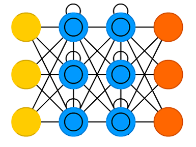

- RNN 기반의 응용들은 대부분 이 LSTM을 이용하여 구현됨
- 은닉층 각 뉴런에 메모리셀(아래의 gate) 추가

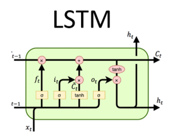

- Forget gate: 과거의 정보를 어느정도 기억할지 결정과거의 정보와 현재 데이터를 입력 받아 sigmoid를 취한 뒤에 그 값을 과거의 정보에 곱한다

  ​	sigmoid=0 → 과거의 정보 잊음

  ​	sigmoid=1 → 과거의 정보 온전히 보존

- Input gate: 과거의 정보와 현재 데이터를 입력 받아 sigmoid와 tanh 함수를 기반으로 현재 정보에 대한 보존량을 결정

- Output gate: 과거의 정보와 현재 데이터를 이용하여 뉴런의 출력을 결정

## 4. Autoencoder

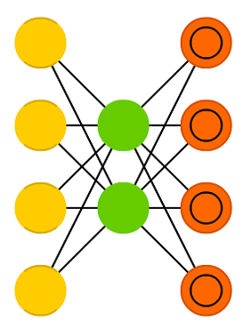

- Input과 output(예측값)을 모두 이용하여 input을 예측하는 것을 보통  supervised learning
- But, 여기선 unsupervised learning 기반(예측값 필요x)
- 처음 입력값을 모든 층을 거치고 다시 출력되도록 동작함  why?
- (사실) 출력층의 출력x  은닉층의 출력을 이용 (입력에 대한 다음 두가지로의 활용)
  Data compression : 일반적으로 hidden layer를 입출력 보다 작게 설정하므로
  Latent representation : hidden layer에서 input을 잘 표현하기 위한 새로운 공간을 형성하므로 latent representation 으로 활용
  딥 러닝에서는 주로 Latent representation를 이용한 예측 성능 향상을 실험적으로 보여줌

## 5. Variational Auto Encoder (VAE)

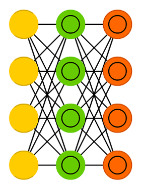

- Autoencoder에 확률 개념 추가
- 위에선 input을 그대로 복원, 여기선 input을 생성하는 확률 분포의 확률밀도함수를 학습하는 것

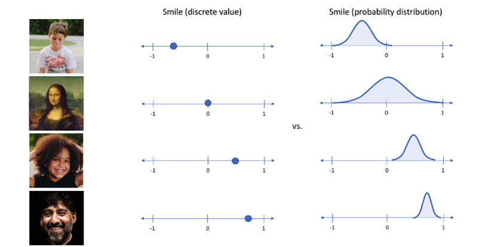

- 계산 및 학습의 편의성, 범용성 등을 위해 확률 분포를 Gaussian이라고 가정
- 입력 데이터(input)이 생성되는 확률 분포 자체를 학습하므로, generative model로도 활용 가능
- generative model? 그게 뭔데?

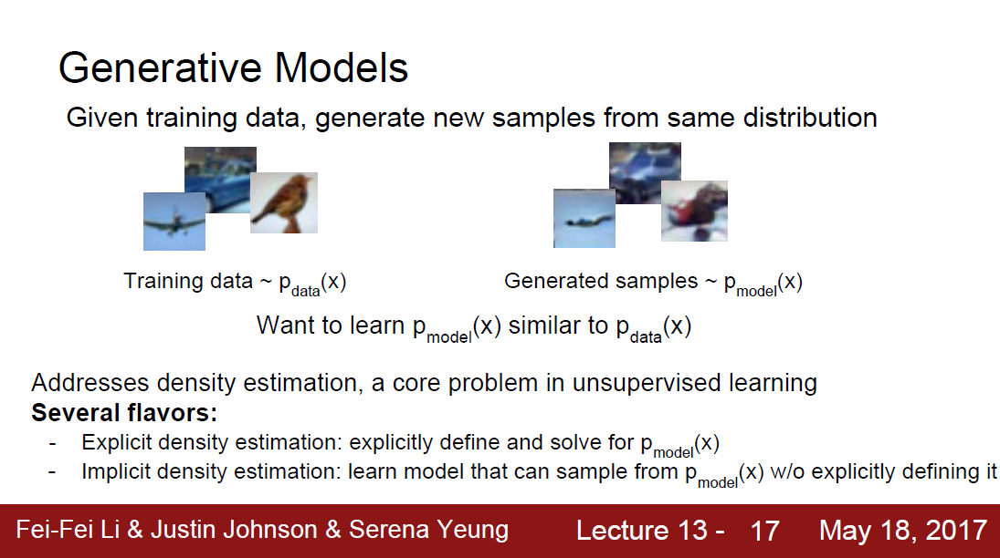

​	*Generative model : 학습 데이터의 분포와 유사한 데이터를 생성하는 모델 (그 차이가 적을수록 실제 데이터와 비슷한 데이터를 생성)

​	*Explicit density: 학습 데이터의 분포를 기반으로 할 것인지

​	*Implicit density: 그러한 분포를 몰라도 생성할 것인지 → **GAN**

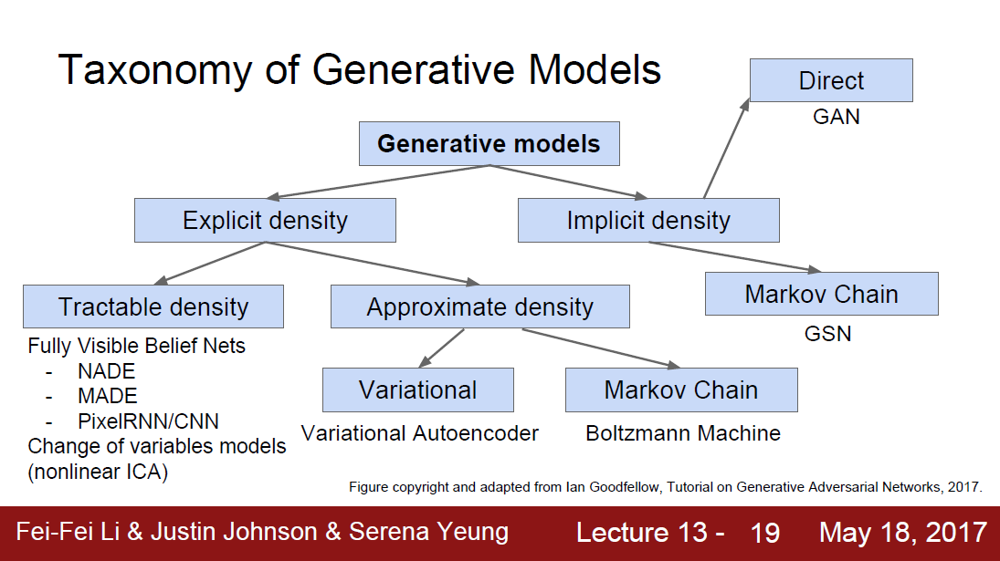

## 6. Convolutional Neural Network (CNN)

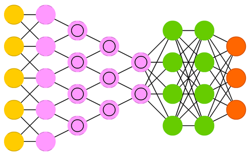

- 생명체의 시각 처리 방식을 모방하기 위해 convolution이라는 연산을 인공신경망에 도입
- 이미지 처리 분야에서 기존의 머신 러닝 알고리즘들을 압도
- 2016년에 공개된 알파고에서도 CNN 기반의 딥 러닝 알고리즘
- 입출력 부분 뉴런들이 느슨하게 연결 DFN,RNN에 비해 학습 가중치가 적어 학습 및 예측이 빠르다는 장점
- 이러한 장점으로 이미지뿐만 아니라 시계열 데이터에도 CNN을 적용하는 연구가 활발

## 7. Deep Residual Network (DRN)

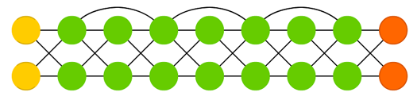

- Layer가 많아질 수록 성능이 증가하는가?라는 딥 러닝의 근본적인 질문에서 시작(layer 많아질 수록 학습이 어려워지므로)
- DRN저자들이 skip connection을 제안
- Layer 순서에 따라 순차적뿐만 아니라, 그림처럼 더 이후 layer까지 직접 전달
- 주로 CNN에 skip connection이 결합된 형태로 이용 → ResNet
- ResNet은 다양한 이미지 처리 분야에서 뛰어난 성능 보임

## 8. Generative Adversarial Network (GAN)

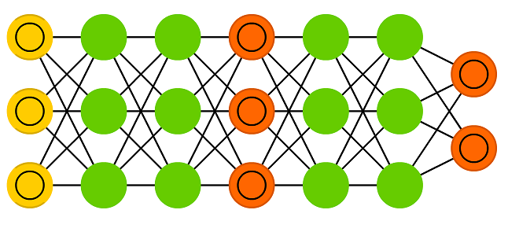

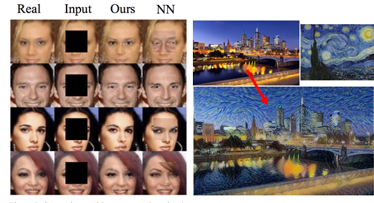

- VAE와 같은 generative model이며, 특히 이미지를 생성하는데 있어서 뛰어난 성능 보임

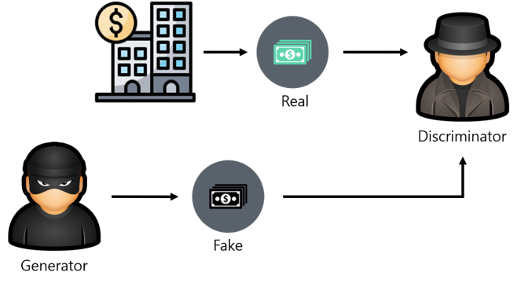

- **G**enerator와 **D**iscriminator라는 두 개의 인공신경망이 서로 경쟁하며 학습 진행
- 이 과정을 계속 반복하면 **D**는 진짜와 가짜 데이터를 잘 구분, **G**는 더욱 진짜 같은 가짜를 만들겠지? → 경쟁을 통해 두 모델 성능이 모두 향상

## 9. Graph Neural Network (GNN)

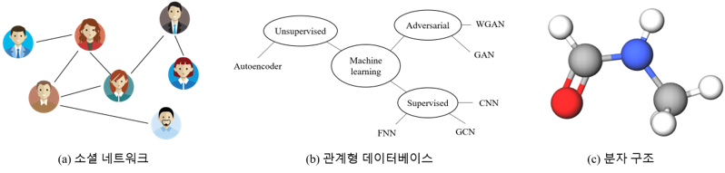

- Normal NN은 input data가 Euclidean space에 존재함을 가정 (벡터 or 행렬)
- 소셜 네트워크, 관계형 데이터베이스, 분자 구조처럼 표현 불가능한 그래프 형태는?ㅜㅜ
- 주로 spectral graph theory기반 Graph Convolutional Network (GCN) 이용

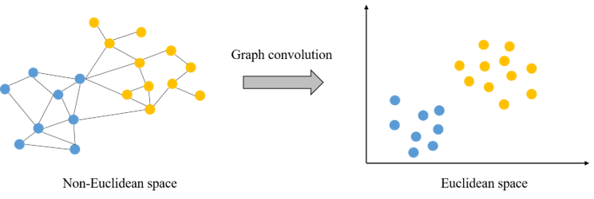

**Specially, Graph Convolutional Network (GCN)**

- Graph convolution 이용하여, 그래프 데이터를 node embedding vector들로 변환 (Readout)

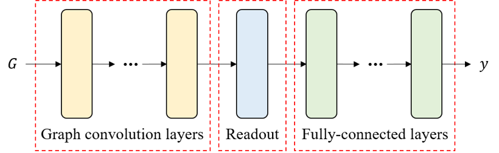

- Readout의 역할은 전체 node의 latent feature vector를 평균내어 그래프 전체를 표현하는 하나의 벡터를 생성(Graph classification/regression에서는 readout이 필수적이지만, node classification이나 link prediction에서는 readout이 없는 구조를 이용)
- 그 다음, fully-connected layer에 입력되어 node나 그래프에 대한 예측 진행

## 10. Spiking Neural Network (SNN)

- 각 뉴런이 fully-connected 된 것이x, 

  ​	→ 연관된 동작을 하는 뉴런들끼리만 연결됨 (실제 생물의 뇌처럼 비슷한 구조)

  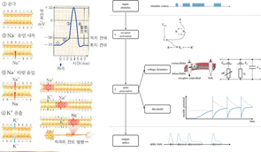

- 기존처럼 실수 값의 output이 아닌, 

  ​	→ 0 또는 1의 binary 값을 출력

  ​	→ 해석하기 어려워짐

- 막전위(membrane potential) : 뉴런이 특정 전위에 도달할 때 spike 발생을 통해서 동작 여부를 나타냄, 그리고서 해당 뉴런의 포텐셜 값 초기화

- 가장 일반적인 LIF(Leaky Integrate-and-Fire)모델 (작용제-길항제)

- 세포에서 some equilibrium이 도달되지 못할 때, membrane을 통해 발생하는 이온의 확산 반영

- threshold를 초과하지 않으면 potential의 변화를 그냥 leak out해버림

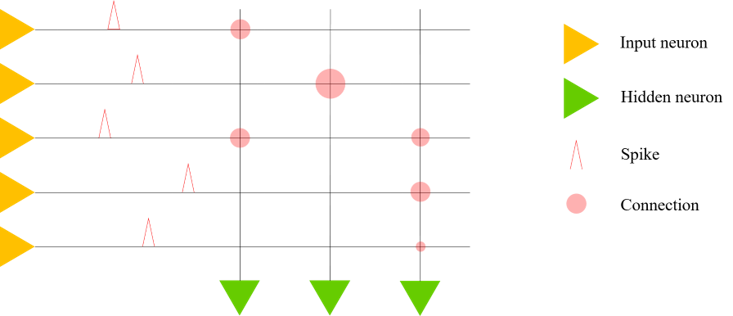

- Spike를 사용하는 학습 장점

  ​	→ 시공간 데이터를 처리할 수 있도록 해줌(실제 세계에서의 감각 데이터와 같은)
  SNN 뉴런의 또 다른 특징, 뉴런 자체에서 시간에 따라 출력값이 변해

- 이는 신경망 자체의 복잡성 증가 없이도 **시간에 종속적인 데이터에 대한 처리가 가능함**을 의미

- 기존 인공신경망보다 유용하다는 것은 입증됨

- But, 아직 SNN을 효과적으로 학습시킬 수 있는 최적화 알고리즘이 개발되지 않은 상태

- 뉴런마다 시간에 따른 출력값 변화의 지속적 계산 필요로 많은 계산량이 요구되어 한계점 존재

  ​	→ 아직까진 기존 인공신경망 사용

### References

[1]. https://www.asimovinstitute.org/neural-network-zoo/

[2]. https://untitledtblog.tistory.com/154

[3]. https://m.post.naver.com/viewer/postView.nhn?volumeNo=16198319&memberNo=3185448

