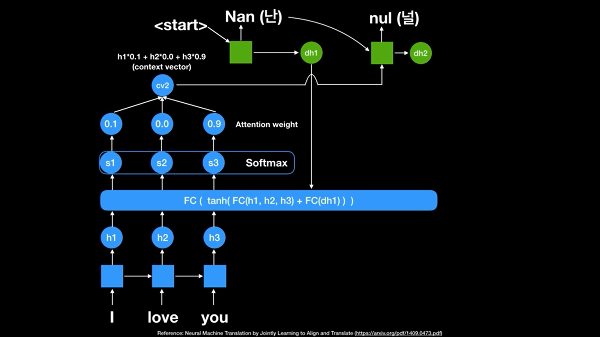
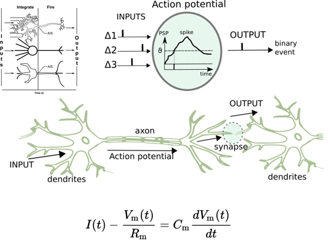
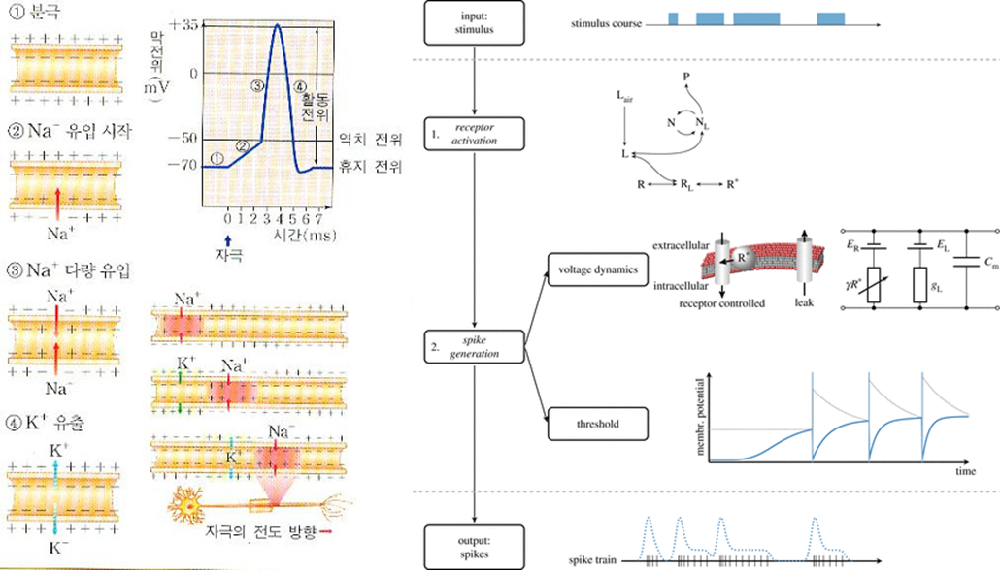

# **Artificial Neural Network**

- 위에 여러 신경망들이 있지만, 이 중에서 대표적인 11가지만 알아보자

- 위 그림에서는 왼쪽 부분의 각 cell의 색과 안에 세모 네모와 같은 기호가 의미하는 바만 보고 넘어가기    

  

1. **Deep Feedforward Network (DFN)**
2. **Recurrent Neural Network (RNN)**
3. **Long Short-Term Memory (LSTM)**
4. **Auto Encoder (AE)**
5. **Variational Auto Encoder (VAE)**
6. **Convolutional Neural Network (CNN)**
7. **Deep Residual Network (DRN)**
8. **Generative Adversarial Network (GAN)**
9. **Attention Network (AN)**
10. **Graph Neural Network (GNN)**
11. **Spiking Neural Network (SNN)**

- 위에 나열한 대표적인 인공 신경망에 대해서 그 구조와 개념을 **간단히** 알아보자 
  (수식 다 빼고 모든 개념은 5줄 이내로 설명해 할 것)
  (이런 느낌이구나 정도로만 알고 가기)         

## 1. Deep Feedforward Network (DFN)

- 딥 러닝의 가장 기본적인 인공신경망
- 입력층, 은닉층, 출력층으로 구성
- 보통 2개 이상의 은닉층을 이용
- 예측값으로 변환된 뒤, 현재 데이터에 대한 정보는 완전히 사라짐 (저장X) → 시계열 데이터 처리 시 한계점 존재
- 이를 보완하기 위해 제안된 것이 RNN     

## 2. Recurrent Neural Network (RNN)

- 시계열 데이터(or 문자열) 같이 시간적 연속성 있는 데이터 처리를 위해 등장

- (앞에 입력된) 이전 시간 데이터에 의해 뒤에 입력된 데이터의 예측이 영향 받음

- (Feedforward 방식의) DFN으로는 시계열 데이터에 대한 정확한 예측이 어려움

- 은닉층 각 뉴런에 순환(Recurrent) 연결을 추가 

  → 이전 시간 데이터에 대한 은닉층의 출력을 현재 시간 데이터 예측 시 다시 은닉층 뉴런에 입력

  → 이전 데이터와 같이 고려하여 현재 시간에 입력된 데이터에 대한 예측을 수행

- But, 단순한 RNN은 역전파 알고리즘 기반 오랜시간 데이터 학습 시 **vanishing/exploding gradient problem** 발생 → 그래서 **LSTM **    

*Elman, Jeffrey L. “Finding structure in time.” Cognitive science 14.2 (1990): 179-211.*    
[Original Paper PDF ](https://crl.ucsd.edu/~elman/Papers/fsit.pdf)      

## 3. Long Short-Term Memory (LSTM)

- RNN 기반의 응용들은 대부분 이 LSTM을 이용하여 구현됨
- 은닉층 각 뉴런에 메모리셀(아래의 gate) 추가

- Forget gate: 과거의 정보를 어느정도 기억할지 결정과거의 정보와 현재 데이터를 입력 받아 sigmoid를 취한 뒤에 그 값을 과거의 정보에 곱한다

  ​	sigmoid=0 → 과거의 정보 잊음

  ​	sigmoid=1 → 과거의 정보 온전히 보존

- Input gate: 과거의 정보와 현재 데이터를 입력 받아 sigmoid와 tanh 함수를 기반으로 현재 정보에 대한 보존량을 결정

- Output gate: 과거의 정보와 현재 데이터를 이용하여 뉴런의 출력을 결정    

*Hochreiter, Sepp, and Jürgen Schmidhuber. “Long short-term memory.” Neural computation 9.8 (1997): 1735-1780.*    
[Original Paper PDF](https://www.bioinf.jku.at/publications/older/2604.pdf)     

## 4. Autoencoder

- Input과 output(예측값)을 모두 이용하여 input을 예측하는 것을 보통 supervised learning이라 함
- But, 여기선 unsupervised learning 기반 (예측값 필요x)
- 처음 입력값을 모든 층을 거치고 다시 출력되도록 동작함 → 입력이 왜 필요하지?
- Autoencoder는 출력층의 출력이 아닌, 은닉층의 출력을 이용하는 것에 목적을 둠 (입력에 대한 다음 두가지로의 활용)
  Data compression: 일반적으로 hidden layer를 입출력 보다 작게 설정하므로 압축 데이터로 봄
  Latent representation: hidden layer에서 input을 잘 표현하기 위한 새로운 공간을 형성하므로 hidden layer의 출력은 latent representation으로 활용 가능
- 딥러닝에서는 주로 Latent representation를 이용한 예측 성능 향상을 실험적으로 보여줌    

*Bourlard, Hervé, and Yves Kamp. “Auto-association by multilayer perceptrons and singular value decomposition.” Biological cybernetics 59.4-5 (1988): 291-294.*    
[Original Paper PDF](https://pdfs.semanticscholar.org/f582/1548720901c89b3b7481f7500d7cd64e99bd.pdf)     

## 5. Variational Auto Encoder (VAE)

- Autoencoder에 확률 개념 추가
- 위에선 input을 그대로 복원, 여기선 input을 생성하는 확률 분포의 확률밀도함수를 학습하는 것

- 계산 및 학습의 편의성, 범용성 등을 위해 확률 분포를 Gaussian이라고 가정
- 입력 데이터(input)이 생성되는 확률 분포 자체를 학습하므로, generative model로도 활용 가능
- generative model? 그게 뭔데?

​	*Generative model : 학습 데이터의 분포와 유사한 데이터를 생성하는 모델 (그 차이가 적을수록 실제 데이터와 비슷한 데이터를 생성)

​	*Explicit density: 학습 데이터의 분포를 기반으로 할 것인지

​	*Implicit density: 그러한 분포를 몰라도 생성할 것인지 → **GAN**

​    

*Kingma, Diederik P., and Max Welling. “Auto-encoding variational bayes.” arXiv preprint arXiv:1312.6114 (2013).*    
[Original Paper PDF](https://arxiv.org/pdf/1312.6114v10.pdf)     

## 6. Convolutional Neural Network (CNN)

- 생명체의 시각 처리 방식을 모방하기 위해 convolution이라는 연산을 인공신경망에 도입
- 이미지 처리 분야에서 기존의 머신 러닝 알고리즘들을 압도
- 2016년에 공개된 알파고에서도 CNN 기반의 딥 러닝 알고리즘
- 입출력 부분 뉴런들이 느슨하게 연결 → DFN,RNN에 비해 학습 가중치가 적어 학습 및 예측이 빠르다는 장점
- 이러한 장점으로 이미지뿐만 아니라 시계열 데이터에도 CNN을 적용하는 연구가 활발    

*LeCun, Yann, et al. “Gradient-based learning applied to document recognition.” Proceedings of the IEEE 86.11 (1998): 2278-2324.*
[Original Paper PDF](http://yann.lecun.com/exdb/publis/pdf/lecun-98.pdf)     

## 7. Deep Residual Network (DRN)

- Layer가 많아질 수록 성능이 증가하는가?라는 딥 러닝의 근본적인 질문에서 시작(layer 많아질 수록 학습이 어려워지므로)
- DRN저자들이 **skip connection**을 제안
- Layer 순서에 따라 순차적뿐만 아니라, 그림처럼 더 이후 layer까지 직접 전달
- 주로 CNN에 skip connection이 결합된 형태로 이용 → **ResNet**
- ResNet은 다양한 이미지 처리 분야에서 뛰어난 성능 보임    

*He, Kaiming, et al. “Deep residual learning for image recognition.” arXiv preprint arXiv:1512.03385 (2015).*    
[Original Paper PDF](https://arxiv.org/pdf/1512.03385v1.pdf)      

## 8. Generative Adversarial Network (GAN)

- VAE와 같은 generative model이며, 특히 이미지를 생성하는데 있어서 뛰어난 성능 보임

- **G**enerator와 **D**iscriminator라는 두 개의 인공신경망이 서로 경쟁하며 학습 진행
- 이 과정을 계속 반복하면 **D**는 진짜와 가짜 데이터를 잘 구분, **G**는 더욱 진짜 같은 가짜를 만들겠지? → 경쟁을 통해 두 모델 성능이 모두 향상    

*Goodfellow, Ian, et al. “Generative adversarial nets.” Advances in Neural Information Processing Systems (2014).*    
[Original Paper PDF](https://arxiv.org/pdf/1406.2661v1.pdf)     

## 9. Attention Network (AN)

- Attention 네트워크는 기존 seq2seq 모델에서 더 발전된 Transformer 모델에서 사용되었으며, 인코더-디코더 구조를 따르면서도 RNN을 사용하지 않고 attention으로 대체하여 성능을 더 높인 것으로 잘 알려져 있음

- 그렇다면 이 attention mechanism이 뭘까?

  - 기존 RNN 기반 seq2seq모델은 크게 두가지 문제점이 존재
    1. 하나의 고정된 크기의 벡터(context vector)에 모든 정보를 압축하려고 하니까 정보 손실이 발생
    2. RNN의 고질적인 문제인 기울기 소실(Vanishing Gradient) 문제 존재

  - Attention은 위의 문제들을 이렇게 해결

    1. 인코더의 모든 cell의 state 정보를 항상 사용하여 디코더에서 dynamic하게 context vector 새로 만들음 → 고정된 크기 벡터 문제 해결 가능
    2. 단, 모든 state 를 동일하게 참고하는 것이 아닌 집중(attention)해야할 state만 선택할 수 있도록 설계 가능

  - Attention network 흐름  ([허민석님 youtube 참고](https://www.youtube.com/watch?v=WsQLdu2JMgI))

    

    - 인코더의 각 cell에 있는 score값을 softmax를 취해 확률값인 attetion weight를 구할 수 있음 (이 확률 분포를 attention distribution이라 함)
    - 이를 인코더의 각 state 정보(h)들과 곱해서 모두 더한 값을 attention value 또는 context vector라고 함
    - 이 context vector를 디코더에 넣어서 output을 구하고 현재 디코더의 state값을 다시 인코더에 넣어서  위의 과정을 반복함
    - Query, key, value로의 설명은 [여기](https://wikidocs.net/22893)를 참고     

*Jaderberg, Max, et al. “Spatial Transformer Networks.” In Advances in neural information processing systems (2015): 2017-2025.*    
[Original Paper PDF](https://arxiv.org/pdf/1506.02025.pdf)      

## 10. Graph Neural Network (GNN)

- Normal NN은 input data가 Euclidean space에 존재함을 가정 (벡터 or 행렬)
- 소셜 네트워크, 관계형 데이터베이스, 분자 구조처럼 표현 불가능한 그래프 형태는?ㅜㅜ
- 주로 spectral graph theory기반 Graph Convolutional Network (GCN) 이용

**Specially, Graph Convolutional Network (GCN)**

- Graph convolution 이용하여, 그래프 데이터를 node embedding vector들로 변환 (Readout)

- Readout의 역할은 전체 node의 latent feature vector를 평균내어 그래프 전체를 표현하는 하나의 벡터를 생성(Graph classification/regression에서는 readout이 필수적이지만, node classification이나 link prediction에서는 readout이 없는 구조를 이용)
- 그 다음, fully-connected layer에 입력되어 node나 그래프에 대한 예측 진행

## 11. Spiking Neural Network (SNN)

- 각 뉴런이 fully-connected 된 것이x, 

  ​	→ 연관된 동작을 하는 뉴런들끼리만 연결됨 (실제 생물의 뇌처럼 비슷한 구조)

  

- 기존처럼 실수 값의 output이 아닌, 

  ​	→ 0 또는 1의 binary 값을 출력

  ​	→ 해석하기 어려워짐

- 막전위(membrane potential) : 뉴런이 특정 전위에 도달할 때 spike 발생을 통해서 동작 여부를 나타냄, 그리고서 해당 뉴런의 포텐셜 값 초기화

- 가장 일반적인 LIF(Leaky Integrate-and-Fire)모델 (작용제-길항제)

- 세포에서 some equilibrium이 도달되지 못할 때, membrane을 통해 발생하는 이온의 확산 반영

- threshold를 초과하지 않으면 potential의 변화를 그냥 leak out해버림

- Spike를 사용하는 학습 장점

  ​	→ 시공간 데이터를 처리할 수 있도록 해줌 (실제 세계에서의 감각 데이터와 같은)
  SNN 뉴런의 또 다른 특징, 뉴런 자체에서 시간에 따라 출력값이 변해

- 이는 신경망 자체의 복잡성 증가 없이도 **시간에 종속적인 데이터에 대한 처리가 가능함**을 의미

- 기존 인공신경망보다 유용하다는 것은 입증됨

- But, 아직 SNN을 효과적으로 학습시킬 수 있는 최적화 알고리즘이 개발되지 않은 상태

- 뉴런마다 시간에 따른 출력값 변화의 지속적 계산 필요로 많은 계산량이 요구되어 한계점 존재

  ​	→ 아직까진 기존 인공신경망 사용 

- 실제 인간의 뇌와 같은 SNN이 실현 가능하다면 asynchronous data를 가지는 이벤트 카메라와 같은 센서에서도 적용이 잘되지 않을까?

### References

[1]. https://www.asimovinstitute.org/neural-network-zoo/

[2]. https://untitledtblog.tistory.com/154

[3]. https://m.post.naver.com/viewer/postView.nhn?volumeNo=16198319&memberNo=3185448

[4]. https://www.youtube.com/watch?v=WsQLdu2JMgI

[5]. https://wikidocs.net/22893
